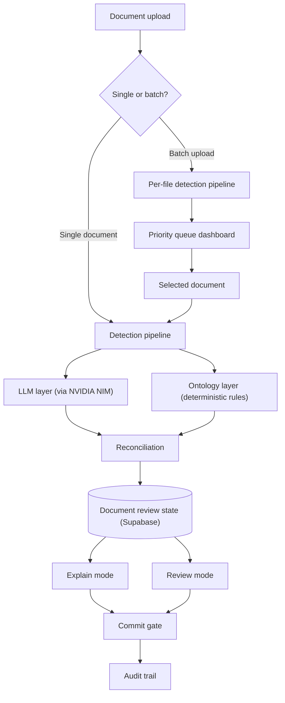
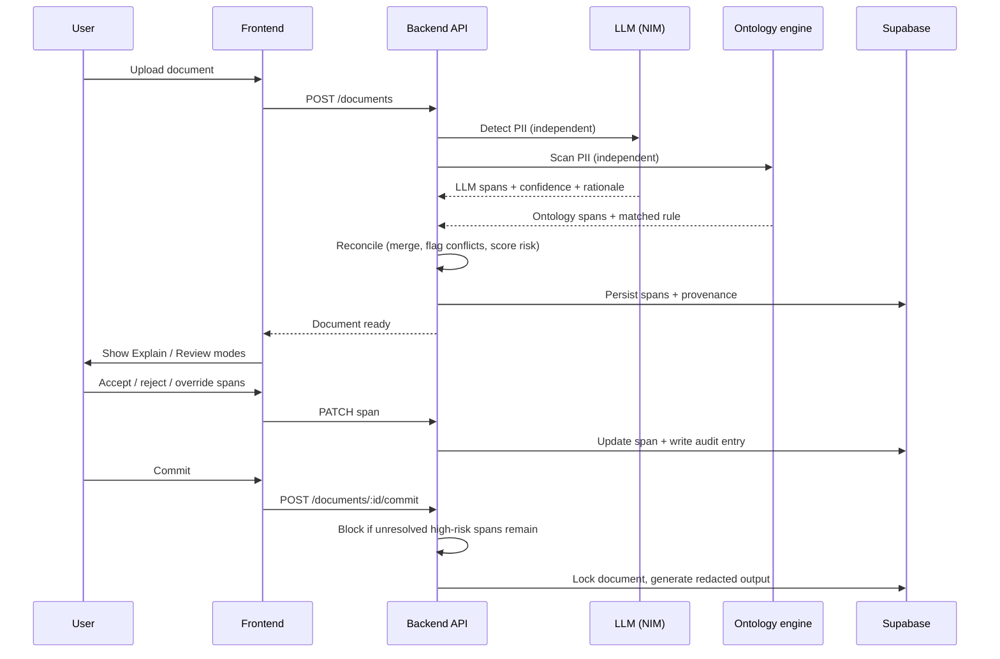
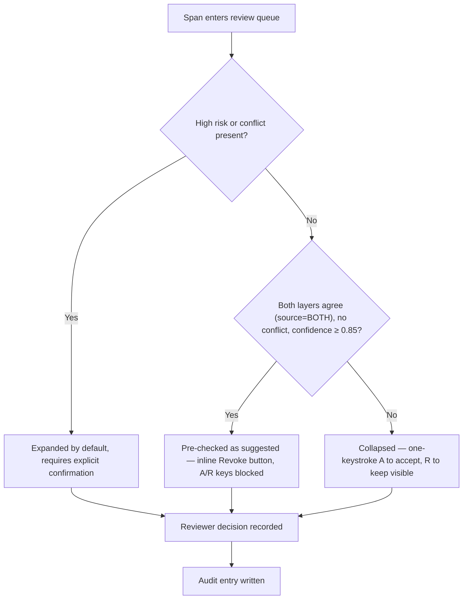
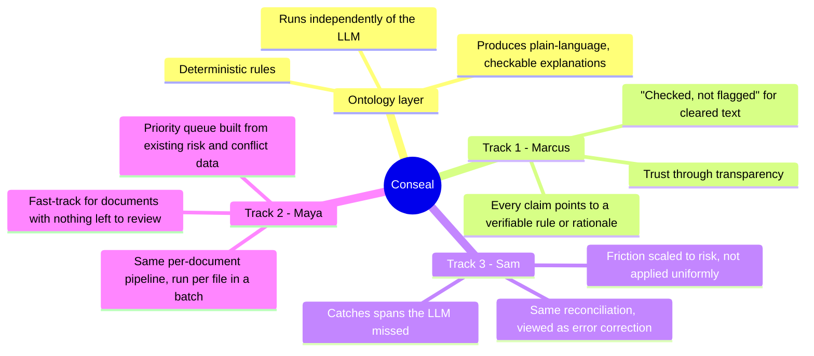
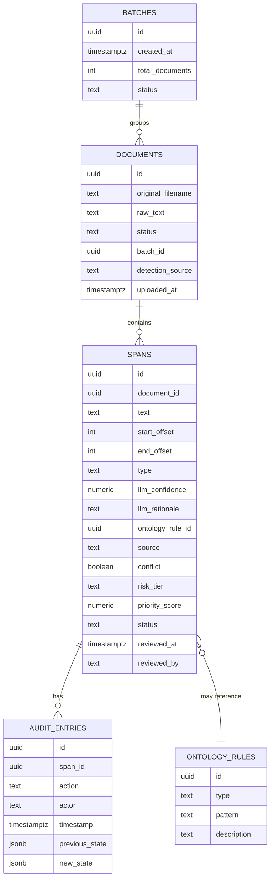

# Conseal

**A document redaction review system built around one core idea: a redaction is only trustworthy if you can verify why it happened.**

Built for the Sprintfour Hackathon. Solves all three problem tracks — explainability (Marcus), correction at volume (Sam), and high-throughput review (Maya) — from a single hybrid detection architecture, rather than three separate features bolted together.

---

## Table of contents

1. [Overview](#overview)
2. [The problem](#the-problem)
3. [Our approach](#our-approach)
4. [Why the ontology layer is the center of this system](#why-the-ontology-layer-is-the-center-of-this-system)
5. [The ontology layer: implementation](#the-ontology-layer-implementation)
6. [Architecture](#architecture)
7. [Hard cases this system is designed for](#hard-cases-this-system-is-designed-for)
8. [Technology stack and rationale](#technology-stack-and-rationale)
9. [Project structure](#project-structure)
10. [Getting started](#getting-started)
11. [Usage walkthrough](#usage-walkthrough)
12. [API overview](#api-overview)
13. [Known limitations and deliberate scope decisions](#known-limitations-and-deliberate-scope-decisions)
14. [Future improvements](#future-improvements)
15. [Acknowledgments](#acknowledgments)

---

## Overview

Conseal is built by Sprintfour to anonymize documents — redacting or labeling personally identifying information so documents can be safely shared with AI tools without leaking private data. This implementation focuses on the part of that problem that's hardest to get right: not detecting PII, but giving a human reviewer a trustworthy, efficient way to verify, correct, and approve what was detected, whether they're reviewing one sensitive document carefully or fifty documents under deadline pressure.

The system runs PII detection through two independent layers — a cloud LLM and a deterministic rule-based ontology — and never lets one silently override the other. Every redaction decision carries its own evidence. Every disagreement between the two layers is surfaced, not hidden. Every irreversible action requires the user to see exactly what they're about to do before they do it.

## The problem

Three personas, three failure modes, one underlying tension:

- **Marcus** won't adopt a redaction tool he can't interrogate. He's been burned by tools that claim to redact but don't, and he distrusts anything that asks him to take its word for it.
- **Sam** moves fast and trusts the tool a little too much — the mistakes that slip through are the ones he doesn't stop to look at.
- **Maya** has dozens of documents to clear before end of day and will abandon any tool that makes her review them one at a time with no sense of which ones actually need her attention.

These look like three different products. They aren't. Marcus needs the system to justify itself; Sam needs the system to catch what he'd otherwise miss; Maya needs the system to tell her where to look first. All three needs are answered by the same underlying question: **can this system tell you, specifically and verifiably, why it made the call it made?** Everything in this README follows from treating that as the one problem to solve well, rather than three.

## Our approach

Two detectors run independently against every document:

- A cloud LLM (via NVIDIA NIM) reads the document and proposes PII spans with confidence scores and natural-language rationale.
- A deterministic ontology layer scans the same raw text independently — not the LLM's output — using explicit, auditable rules.

Independently is the operative word. If the ontology only checked spans the LLM had already flagged, it would inherit the LLM's blind spots instead of catching them. Running both detectors against the same raw input, then reconciling the two outputs afterward, is what makes the rest of the system possible.

## Why the ontology layer is the center of this system

This is the part worth reading carefully, because it's the architectural decision the rest of the project hangs off of.

An LLM explaining its own redaction decision has a credibility problem: the same system that made the call is the one vouching for it. That's not a justification Marcus can verify — it's the model's word, twice. A second, deterministic layer changes that. When the ontology layer matches a span, it can point to the literal rule that fired — a specific pattern, a specific structural check — not a generated sentence asserting confidence. That's the difference between an explanation and an excuse.

The same mechanism that makes the ontology layer useful for **explaining** a decision is what makes it useful for **catching a missed one**. A rule that independently flags a phone number the LLM skipped isn't doing two different jobs — explainability and error-correction are the same operation viewed from two angles: *can this system justify, with evidence, what is and isn't PII in this text?* Track 1 (Marcus) asks that question of the spans that were flagged. Track 3 (Sam) asks it of the spans that weren't. One reconciliation engine answers both.

This is also why the system never lets the ontology layer silently overrule the LLM, or vice versa. A reconciliation step that quietly picks a winner and presents one clean answer would simply relocate the trust problem one layer deeper — Marcus would now have to trust the reconciler instead of the LLM. Instead, every disagreement is preserved as a visible conflict: both verdicts shown, the disagreement itself explained. The system earns trust by showing its disagreements, not by hiding them.

Track 2 (Maya) inherits this for free. Once every span has a structured, machine-checkable provenance record — which layer found it, whether the layers agree, how severe the PII type is — that record is exactly the input a priority function needs. A document's review priority is just that same per-span evidence rolled up: how many high-risk spans are still unresolved, how many conflicts exist, weighted by the same risk and confidence values Marcus and Sam already rely on. Maya's queue isn't a separate feature with its own logic — it's a sort order computed from data the ontology/reconciliation layer was already producing. Three tracks, one source of truth.

## The ontology layer: implementation

The ontology layer (`Backend/src/services/detection/ontologyDetector.js`) scans raw document text independently using a fixed set of rules defined in `ontologyRules.js`. Each rule has a PII type, an optional regex pattern (or structural heuristic), and a one-sentence description that is displayable directly to the user. That description is what Marcus sees when he asks why a span was flagged — not a generated summary, but the literal rule.

The current rule set covers seven patterns across five PII types:

| Type | Detection method | What it matches |
|---|---|---|
| `EMAIL` | Regex | Standard `user@domain.tld` format |
| `PHONE` | Regex (numeric) | US and international formats with optional hyphens, dots, or spaces |
| `PHONE` | Regex (spoken) | Sequences of 7–12 spelled-out digit words, e.g. "five one two, five five five, zero one nine two" |
| `SSN` | Regex | Formatted `NNN-NN-NNNN`, or an unformatted 9-digit number preceded by SSN/social security/tax id context words within 20 characters |
| `FINANCIAL_ACCOUNT` | Regex | Digit sequences of 12+ digits adjacent to context words: account, routing, card, acct, iban |
| `NAME` | Structural heuristic | Capitalized multi-word sequences, excluding common stopwords and sentence-leading false positives |
| `NAME` | Regex | Abbreviated name format: last name followed by first initial, e.g. "Smith, J." |
| `ADDRESS` | Regex | House number followed by street-like words ending in a recognized suffix (Street, Ave, Road, Blvd, Drive, Lane, etc.) |

The `NAME` rule intentionally uses a structural heuristic rather than a fixed regex — a regex for names would produce too many false positives on ordinary capitalized sentence openers. The heuristic checks multi-word capitalized sequences against a stopword list, which is explicitly auditable and adjustable, unlike a trained model's internal representations.

Rules run against the full raw text (case-insensitively for the regex rules). When a rule fires, the span record carries the `ontology_rule_id` of the rule that matched, so the rule's `description` field is always retrievable and displayable at review time — it doesn't have to be regenerated.

## Architecture

### System overview



A batch upload is a thin layer on top of the same pipeline: each file is processed exactly as a single document would be, and the only new logic is the priority score used to order the resulting queue. Nothing about detection, reconciliation, or the review screens changes based on how a document arrived.

### Document lifecycle (sequence)



### Review-mode decision logic



Friction in this system is allocated by consequence, not applied uniformly — a deliberate countermeasure to automation bias, where a reviewer under time pressure will otherwise treat every item the same way regardless of stakes.

### How the three tracks share one architecture



### Data model



## Hard cases this system is designed for

A non-exhaustive list of the cases that were deliberately designed for, rather than discovered as bugs:

| Hard case | How it's handled |
|---|---|
| LLM and ontology disagree on type or boundaries | Surfaced as an explicit conflict, both verdicts shown — never silently resolved |
| A span is cleared by both layers | Rendered as an explicit "checked, not flagged" state, not silence |
| A confident-sounding explanation that isn't actually verifiable | Every claim traces to a literal rule or a stated rationale, not an assertion |
| A reviewer under time pressure over-trusting suggestions | Friction is allocated by risk tier and conflict status, not applied uniformly |
| Bulk corrections silently mis-applying to a different entity | Bulk actions require a preview of every affected span before anything is applied |
| A careless commit on an unresolved high-risk span | Commit is blocked with the specific unresolved spans named, not a generic error |
| Same entity name across different documents in a batch | Batch-wide actions never cascade by name across documents — only by per-span criteria |
| A failed file silently disappearing from a batch | Every file failure is reported by name and reason, never dropped quietly |
| The LLM becoming unreachable mid-demo | A documented mock fallback path exists and is visibly flagged in the UI when active, rather than silently substituting data |
| Re-identification through combined, individually-harmless details | Acknowledged as a known limitation rather than claimed as solved (see below) |

## Technology stack and rationale

| Choice | Why |
|---|---|
| **React + Tailwind (frontend)** | Fast to iterate on for a solo build, well suited to the component-driven structure both review modes share |
| **Node.js + Express (backend)** | Single language across the stack reduces context-switching during a time-boxed build; the OpenAI-compatible NIM endpoint and Supabase both have first-class JS clients |
| **NVIDIA NIM (LLM detection layer)** | An OpenAI-compatible endpoint for the LLM detection layer, configurable via `NVIDIA_NIM_MODEL`; chosen for strong reasoning at a usable cost on a free developer tier and swappable behind a single config value if a different model is ever preferred |
| **A deterministic ontology layer instead of a second LLM call** | The entire trust argument in this README depends on having one detector whose output is independently checkable. A second LLM call can't provide that — it would just be two opinions instead of one. A rule either matches or it doesn't, and that's the property the explainability and correction stories both need |
| **Supabase (Postgres)** | A hosted relational store was the right fit given the data model is genuinely relational (documents, spans, rules, audit entries, batches) — and Postgres meant the schema could be written and reasoned about directly, rather than working around a document store's weaker consistency guarantees for an audit trail that needs to be trustworthy |

This stack was chosen for what this problem actually needs — a verifiable second detector, a relational audit trail, and a fast solo build — not because any piece of it is the only valid choice. Where a more conventional production system would add things this one doesn't (authentication, horizontal scaling, rate limiting), those are addressed directly in the limitations section below, not glossed over.

## Project structure

```
Conseal/
├── Backend/
│   ├── src/
│   │   ├── routes/          # Express route definitions
│   │   ├── controllers/     # Request handling
│   │   ├── services/        # Detection, reconciliation, batch orchestration
│   │   │   └── detection/   # LLM detector, mock detector, ontology detector and rules, diagnostics
│   │   ├── repositories/    # Supabase data access (documents, spans, batches, audit, ontology rules)
│   │   ├── middleware/      # Upload handling, error handling
│   │   ├── config/          # Environment configuration
│   │   ├── constants/       # PII type and risk-tier constants
│   │   ├── db/              # Supabase client initialization
│   │   ├── errors/          # Custom AppError class
│   │   └── utils/           # Text extraction, redaction, case mapping, offset utilities, validation
│   ├── supabase/            # SQL schema files (schema.sql, schema_batch.sql, schema_detection_source.sql)
│   ├── scripts/             # check-schema.js, diagnose-nim.js, run-e2e.js
│   ├── diagnostics/         # Runtime NIM diagnostic output (generated, not committed)
│   ├── test/                # Unit tests (ontologyDetector, reconciliation, redaction, validation)
│   ├── NIM_DIAGNOSTIC_REPORT.md
│   └── README.md
├── Frontend/
│   ├── src/
│   │   ├── screens/         # LandingScreen, UploadScreen, BulkUploadScreen, ProcessingScreen,
│   │   │                    #   DocumentScreen, ExplainMode, ReviewMode, CommitScreen,
│   │   │                    #   QueueDashboardScreen
│   │   ├── api/             # client.js (backend HTTP client), mock.js (mock fallback), useDocument.js
│   │   ├── components/      # AuditTrail; ds/ (Badge, Button, Card, Modal, ProgressMeter, Tabs, Tag, Tooltip)
│   │   ├── lib/             # spanUtils.js — span sorting, pre-check, and badge-tone logic
│   │   └── styles/          # Design-system token CSS files
│   └── README.md
├── Design System/           # Sprintfour design system components, tokens, and foundations
├── participant.md
└── README.md                # This file
```

## Getting started

### Prerequisites
- Node.js (v18+)
- A Supabase project (free tier is sufficient)
- An NVIDIA Developer account and API key for NIM (free tier; sign up at build.nvidia.com)

### Backend setup
```bash
cd Backend
cp .env.example .env
npm install
npm run dev
```

The `.env.example` shows all available variables:

```
PORT=3001
NVIDIA_NIM_API_KEY=              # required — your NIM API key
NVIDIA_NIM_BASE_URL=https://integrate.api.nvidia.com/v1
NVIDIA_NIM_MODEL=meta/llama-3.1-8b-instruct   # swap to any NIM-hosted model
NVIDIA_NIM_TIMEOUT_MS=45000
NVIDIA_NIM_MAX_RETRIES=2
SUPABASE_URL=                    # required — your Supabase project URL
SUPABASE_SERVICE_KEY=            # required — your Supabase service role key
USE_MOCK_LLM=true                # set to false to call the live NIM endpoint
ALLOW_MOCK_FALLBACK_ON_LLM_FAILURE=true
```

Apply the database schema via the Supabase SQL editor in this order:
1. `Backend/supabase/schema.sql`
2. `Backend/supabase/schema_batch.sql`
3. `Backend/supabase/schema_detection_source.sql`

### Frontend setup
```bash
cd Frontend
npm install
npm run dev
```

The frontend proxies API requests to the backend; confirm the proxy/base URL in the frontend's environment configuration matches your backend's running port.

### Verifying the setup
- `npm run check:schema` (Backend) confirms the Supabase tables are correctly provisioned
- `npm test` (Backend) runs the unit test suite
- `npm run integration:e2e:mock` (Backend) runs the full document lifecycle against mock detection, without requiring a live LLM call

## Usage walkthrough

1. From the landing page, choose **Single document** or **Bulk upload**.
2. Upload a document (or several). The system runs both detection layers and reconciles the results automatically.
3. From the document overview, choose **Explain mode** to review every detection decision with full justification, or **Review mode** to move through corrections quickly with risk-weighted friction.
4. For batch uploads, the **queue dashboard** orders documents by review priority — highest-risk and most-conflicted documents first — with a fast-track option for documents that need no further attention.
5. Once every high-risk span has an explicit disposition, **commit** finalizes the document. This step is irreversible and clearly marked as such.
6. The **audit trail** shows a full history of every decision made on a document, including which detection layer was responsible for each finding.
7. After committing, the redacted document can be downloaded via `GET /documents/:id/download`.

## API overview

| Endpoint | Purpose |
|---|---|
| `POST /documents` | Upload and process a single document |
| `GET /documents/:id` | Fetch a document and its full span list with provenance |
| `GET /documents/:id/summary` | Aggregate counts by type, risk, and conflict |
| `PATCH /documents/:id/spans/:spanId` | Accept, reject, or override a single span |
| `POST /documents/:id/spans/bulk` | Apply an action to multiple spans, with a dry-run preview mode |
| `POST /documents/:id/commit` | Finalize a document; blocked if high-risk spans remain unresolved |
| `GET /documents/:id/download` | Download the redacted document after commit |
| `GET /documents/:id/audit` | Full chronological audit trail for a document |
| `POST /batches` | Upload and process multiple documents at once |
| `GET /batches/:id` | Fetch all documents in a batch, sorted by review priority |

Full request/response schemas and validation rules are documented in `Backend/README.md`.

## Known limitations and deliberate scope decisions

Stated directly, because the judgment shown in scoping this project is as much a part of the submission as the code:

- **No authentication.** This is a single-user, hackathon-scope demo. Adding auth would have consumed build time better spent on the actual review experience, which is what's being evaluated.
- **The ontology layer uses curated heuristics, not a formal ontology with inference.** A small set of explicit, auditable rules was a deliberate choice — every rule needs to be explainable in one sentence to a skeptical user, and a more elaborate rule system would work against that goal, not for it.
- **Re-identification through combined quasi-identifiers is acknowledged, not solved.** Individually harmless details that become identifying in combination are a known, hard problem; this system doesn't attempt to detect that pattern automatically.
- **Cross-document entity resolution is intentionally absent.** The same name appearing in two different documents in a batch is never assumed to be the same person — correctly handling that would require identity resolution well beyond this project's scope, so the system simply never cascades an action across documents instead of guessing.
- **The LLM detection layer depends on a third-party API (NVIDIA NIM).** A mock detection path exists specifically so the system's core review and reconciliation logic can be demonstrated and verified independent of that external dependency's availability.

## Future improvements

- Confidence-band-aware review prompts for spans sitting near the accept/flag threshold
- Coreference linking so corrections can optionally cascade across repeated mentions of the same entity within one document
- A formal entity-resolution pass for the cross-document case in batch mode
- Configurable risk-tier and priority-scoring weights, exposed to the user rather than hardcoded
- Multi-user review with assignment and concurrency handling for true team-scale batch processing

## Acknowledgments

Built for the Sprintfour Hackathon. Detection powered by NVIDIA NIM. Data persistence via Supabase.
